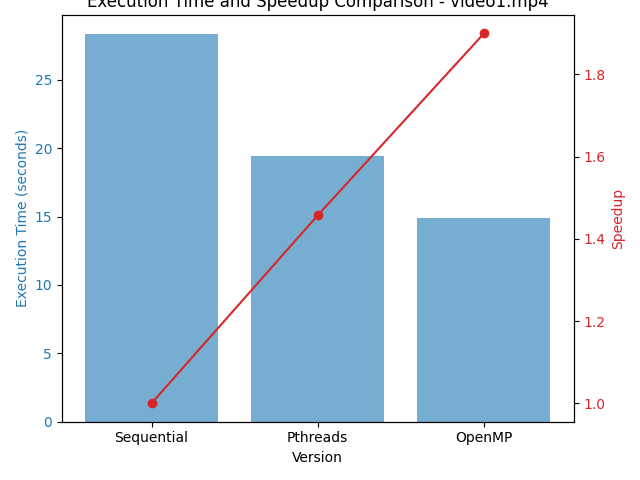
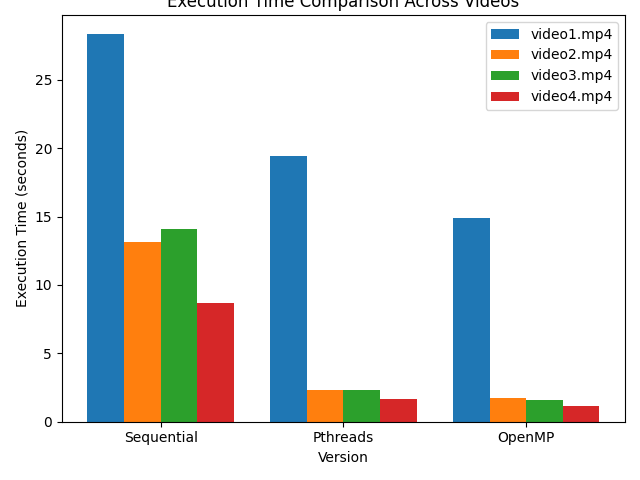
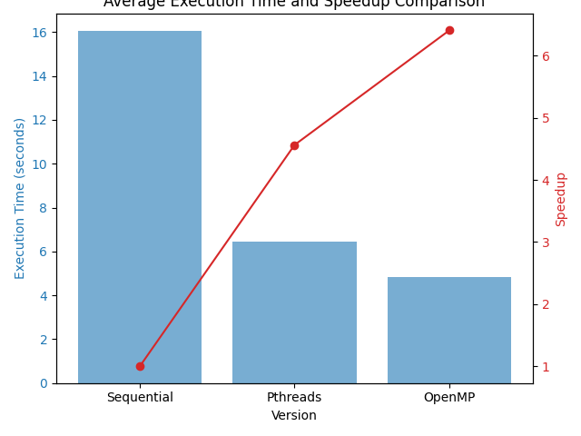
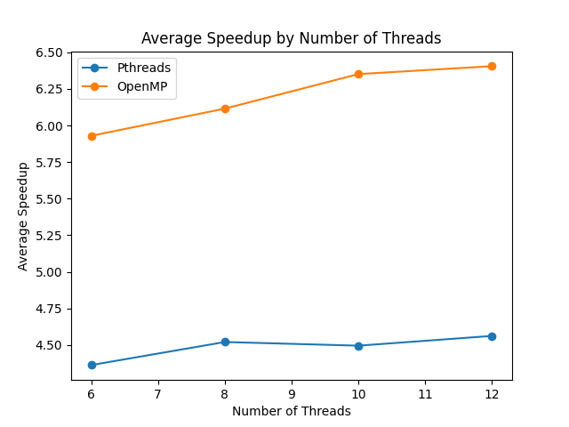

# Video Filter Performance Analysis

## Overview

This project aims to analyze the performance of three different implementations (sequential, Pthreads, and OpenMP) of a video filtering algorithm. The algorithm applies high-pass filters to each frame of a video, and the performance is measured by the execution time and speedup achieved using parallel programming techniques.

## Implementations

1. **Sequential Implementation**: A single-threaded approach that processes each frame of the video one after the other.
2. **Pthreads Implementation**: A multi-threaded approach using the Pthreads library to process multiple frames in parallel.
3. **OpenMP Implementation**: Another multi-threaded approach using the OpenMP library to parallelize the frame processing.

## Setup

### Prerequisites

- g++
- OpenCV
- Python 3
- Matplotlib
- NumPy

### Compilation

The programs can be compiled using the provided Python script, which also manages the execution and analysis.

### Running the Analysis

Execute the `runner.py` script to compile the programs, run the analysis on the provided video files, and generate the plots.

```bash
python3 runner.py
```

## Results

### Individual Results

For each video file, we measure the execution time and speedup for the sequential, Pthreads, and OpenMP implementations. The results are saved as individual plots in the `plots` directory.



### Combined Results

A combined plot shows the execution time across different videos for each implementation.



### Average Results

An average plot shows the execution time and speedup across all videos for each implementation.



### Speedup by Number of Threads

This plot shows the average speedup achieved by the Pthreads and OpenMP implementations as the number of threads varies (6, 8, 10, and 12).



## Conclusion

The analysis demonstrates the effectiveness of parallel programming in improving the performance of video processing algorithms. The results indicate how the number of threads impacts the speedup and overall execution time, providing valuable insights for optimizing performance in multi-threaded environments.
